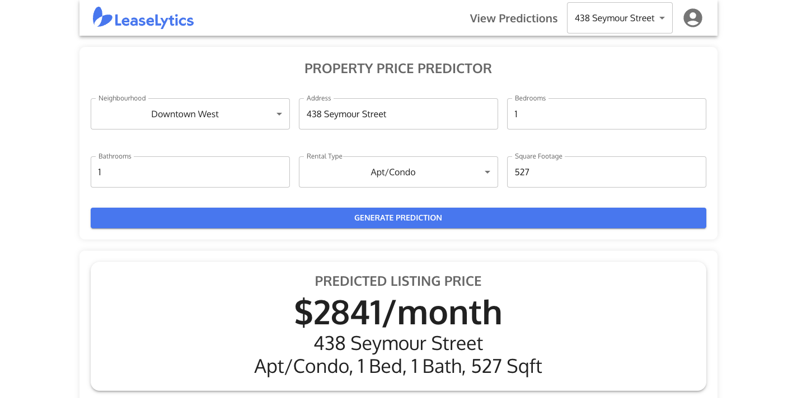
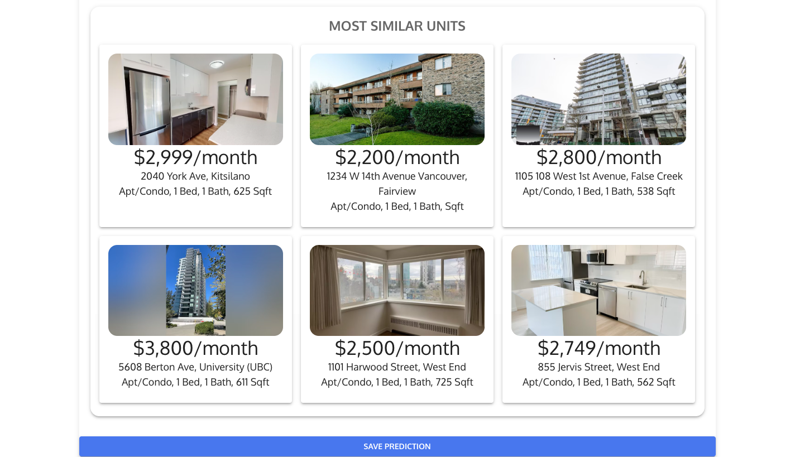

## An intelligent rental home pricing solution

Vancouver has one of the largest rental markets in Canada, yet there are no direct tools to price rental homes. Many landlords are simply guessing when they set their rental price, resulting in lost revenue if priced too high or low. Pricing is a pain point — methods/data are lacking, hiring a consultant is expensive, and research can take lots of time.

Leaselytics is a web-app platform that is a one-stop shop to unlocking the value of your rental home. Offering accurate pricing and market insights, we empower small landlords in Vancouver. Our solution includes the following key features:
- **Powered by AI**: Our model utilizes OpenAI’s `text-embedding-3-large` model and the Pinecone vector database to provide accurate predictions
- **Comparative Market Analysis**: Displays similar rental homes based on the `k`-nearest neighbours from our model
- **Expansive Data Collection**: Our model is trained on extensive data from the Vancouver housing market

## Screenshots

